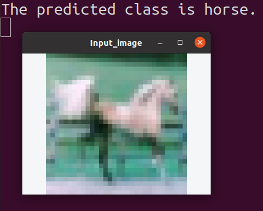

# Deployment of Image Classification Model in C++ Using NCNN

This repo shows an example of deploying image classification model into C++ using NCNN.

## Dependencies

* NCNN
* CMake 3.23.1
* OpenCV 4.5.2
* CUDA 11.4
* CUDNN 8.2.4
* Python 3.8.10
* PyTorch 1.9.1

## NCNN (Neural Network Computing Library) Installation

```bash
git clone https://github.com/Tencent/ncnn.git
cd ncnn
mkdir -p build
cd build
cmake -DCMAKE_BUILD_TYPE=Release -DNCNN_VULKAN=OFF \ 
-DNCNN_SYSTEM_GLSLANG=ON -DNCNN_BUILD_EXAMPLES=ON \
-DNCNN_SHARED_LIB=ON ..
make
make install
```

## Usages

### Training

```bash
git clone 
cd ncnn_image_classification/
python3 scripts/train.py
```

After training, the pretrained PyTorch model (image_classifier.pth) is stored in *models* directory.

### Test on the pretrained PyTorch model

```bash
python3 scripts/text.py
```

The following results will be shown in the terminal.

```bash
The input image ./images/bird2.png
The predicted class is bird
The input image ./images/car.png
The predicted class is car
The input image ./images/bird1.png
The predicted class is bird
The input image ./images/horse.png
The predicted class is horse
```

### Conversion from the pretrained PyTorch model to ONNX model

```bash
python3 scripts/export2onnx.py
```

After the conversion, the ONNX model (image_classifier.onnx) is stored in *models* directory.

### Model conversion from ONNX to NCNN
Copy onnx2ncnn from ncnn_root/build/tools/onnx/ and ncnnoptimize from ncnn_root/build/tools/ to the project root directory. And then run the following commands to convert the ONNX model to the NCNN model.

```bash
python3 -m onnxsim models/image_classifier.onnx \
models/image_classifier_sim.onnx
./onnx2ncnn models/image_classifier_sim.onnx \
models/image_classifier.param models/image_classifier.bin
./ncnnoptimize models/image_classifier.param models/image_classifier.bin \
models/image_classifier_opt.param models/image_classifier_opt.bin 65536
```

### Image classification inference
First, change ncnn_root_dir in CMakeLists.txt to the directory of ncnn in your computer. Then run the following commands.

```bash
mkdir build && cd build
cmake ..
make
./image_classifier
```

The following result will be shown.
<center> 

</center>


## References

* Tencent, Neural Network Computer Vision, https://github.com/tencent/ncnn, 2019.
* https://pytorch.org/tutorials/beginner/blitz/cifar10_tutorial.html
